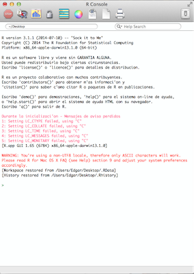

# Clase 140812

Para instalar R en sus computadoras accedan a http://www.est.colpos.mx/R-mirror/

Una vez instalado debemos ver algo semejante a esto (asi se ve en una mac, en windows algo similar debe verse [no se fijen en todos mis warnings en rojo]).



Lo que ahorita importa entender es que el programa es de linea de comando, i.e. tenemos que darle instrucciones despues del > para que el programa haga algo...

Introduzcamos un numero

```{r, echo=FALSE}
4
```

Una suma, resta, producto, division, potenciacion de numeros

```{r, echo=FALSE}
4+3
```
```{r, echo=FALSE}
4*3
```
```{r, echo=FALSE}
4/3
```
```{r, echo=FALSE}
4^3
```

y aplicar funciones conocidas como

```{r, echo=FALSE}
log(4)
```
```{r, echo=FALSE}
exp(4)
```
```{r, echo=FALSE}
factorial(4)
```
```{r, echo=FALSE}
choose(4,3)
```
```{r, echo=FALSE}
abs(-4)
```
```{r, echo=FALSE}
sqrt(4)
```

Pero aqui nada mas estamos imprimiendo la informacion en pantalla pues nada se esta almacenando.

Para ello debemos ver como almacenar

Un numero
```{r, echo=FALSE}
n = 4
```

Y podemos ver que tipo de dato (clase) es n
```{r, echo=FALSE}
class(n)
```

O preguntarle si n es un numero
```{r, echo=FALSE}
is.numeric(n)
```

Un vector
```{r, echo=FALSE}
t = c(2010,2011,2012,2013)
class(t)
is.vector(t)
is.numeric(t)
```

Una palabra
```{r, echo=FALSE}
nombre = "Puma"
is.character(nombre)
```

Un enunciado
```{r, echo=FALSE}
sp = "Puma concolor"
is.character(sp)
```


_Texto escrito sin acentos por razones de compatibilidad. Pero eso no significa que no me importe su ortografia..._