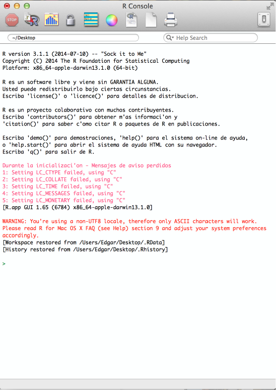

<br />
<br />
Para instalar R en sus computadoras accedan a http://www.est.colpos.mx/R-mirror/

Una vez instalado debemos ver algo semejantea esto (asi se ve en una mac, en windows algo similar debe verse [no se fijen en todos mis warnings en rojo]).



Lo que ahorita importa entender es que el programa es 


R funciona con dos tipos de cosas: clases y funciones.

```{r, echo=FALSE}

```

Texto escrito sin acentos por razones de compatibilidad. Pero eso no significa que no me importe su ortografia...