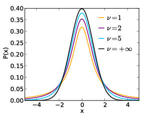
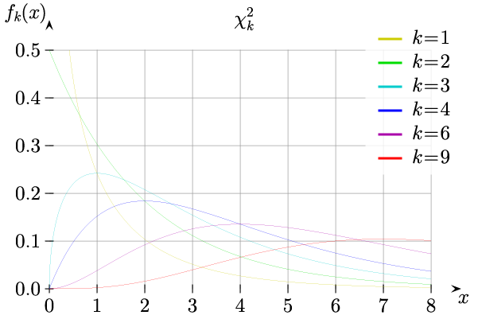
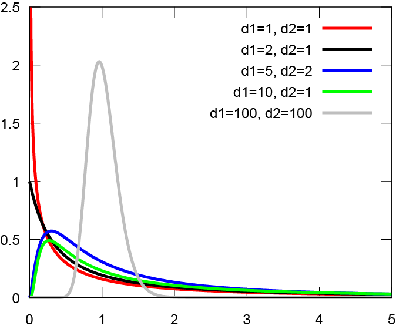

# Clase 141003

## Distribuciones de probabilidad teoricas

### DPT de variables continuas

#### 1. Normal

#### 2. t de Student

La distribucion de probabilidad **t de Student** describe la distribucion de la media de una muestra de tamanio _n-1_ cuando la muestra se toma de una distribucion normal estandar.

A _n-1_ se le llaman los grados de libertad de la distribucion.

Fijense que:

1. Mientras mayores sean los grados de libertad, mejor sera la estimacion de la media poblacional y por lo tanto mas se parecera la distribucion t de Student a la normal.

2. Mientras mayores sean los grados de libertad, mejor sera la estimacion de la desviacion estandar y por lo tanto mas se paracera la distribucion t de Student a la normal.

Entonces decimos que cuando _n_ tiende a infinito, la t de Student tiende a la normal.

Desarrollada por William Sealy Gosset en 1908 bajo el pseudonimo de "Student".

**Parametro**

v = n-1: grados de libertad.

**Formula:**

Fx(x) = P(X < x) = Gamma((v+1)/2)/(sqrt(v*pi)*Gamma(v/2))*integral(-Inf,u)(1+u^2/v)^(-(v+1)/2)du

donde Gamma(x) = integral(0,inf)t^(x-1)*exp(-t)dt

**Propiedades:**

* Simetrica.
* Unimodal.
* Toma valores en todos los numeros reales.
* µ = 0
* sigma = v/(v-2)

En R utilizamos la funcion **pt(x,v)** para obtener la probabilidad de -Inf a x.

Fijense que si usan **pt(x,Inf)** tienen la normal estandar, ie. **pnorm(x)**

Veamos ahora las diferentes tablas de t de Student:

1. P(X < x) dado x y v: http://cdn.slidesharecdn.com/ss_thumbnails/tabla-t-120622105146-phpapp01-thumbnail-4.jpg?cb=1340380341

_ACTIVIDAD1: ¿Que nos da esta tabla:_ http://3.bp.blogspot.com/_C6375WoyYP0/THVqQkJRqbI/AAAAAAAAASU/ML7g-OPPgug/s1600/Student-t-table.png?

_ACTIVIDAD2: Si la estatura de los mexicanos se distribuye normal con media 1.70 m y desviacion estandar de 0.1 m, ¿cual es la probabilidad de que al tomar 10 personas al azar su media sea de 1.75 m?_

#### 3. Ji^2

La distribucion de probabilidad **Ji^2** describe la distribucion de la suma de los valores al cuadrado de una muestra de tamanio _n-1_ de datos tomados de una distribucion normal estandar.

Tambien se puede ver como la distribucion de la suma de cuadrados de una muestra de tamanio _n-1_ de datos tomados de una distribucion normal estandar.

Desarrollada por Friedrich Robert Helmert en 1875 y redescubierta por Karl Pearson en 1900.

**Parametro**

v = n-1: grados de libertad

**Formula:**

Fx(x) = P(X < x) = 1/(2^(v/2)*Gamma(v/2))*integral(-Inf,x)t^(v/2-1)*exp(-t/2)dt

**Propiedades:**

* Asimetrica.
* Unimodal.
* Toma valores en los numeros no negativos, o sea, en [0,+Inf).
* µ = v
* sigma = 2*v

En R utilizamos la funcion **pchisq(x,v)** para obtener P(X < x; v).

Veamos ahora las diferentes tablas de t de Student:

1. P(X < x) dado x y v: https://onlinecourses.science.psu.edu/stat414/sites/onlinecourses.science.psu.edu.stat414/files/lesson16/ChiSquareTableR10.gif

2. x dado P(X > x) y v: http://flylib.com/books/3/287/1/html/2/images/xatab02.jpg

_ACTIVIDAD3: ¿Cual es la probabilidad de que al tomar 10 personas al azar su varianza muestral sea de 0.2 m?_

#### 4. F

La distribucion de probabilidad **F** describe la distribucion del cociente de las varianzas muestrales de dos muestras, una de tamanio _n1_ y otra de tamanio _n2_, tomando los datos de una distribucion normal estandar.

Desarrollada por R. A. Fisher en 1924 (aunque presentada originalmente como 1/2*ln(F) para describir la distribucion de la heterocigocidad en una poblacion) y tabulada (como F) por Snedecor en 1934.

**Parametros**

v1 = n1-1: primeros grados de libertad 
v2 = n2-1: segundos grados de libertad

**Formula:**

Fx(x) = P(X < x) = 1/B(v1/2,v2/2)*(v1/v2)^(v1/2)*integral(-Inf,x)u^(v1/2-1)*(1+v1/v2*u)^(-(v1+v2)/2)du

donde B(v1/2,v2/2) = integral(0,1)u^(v1/2-1)*(1-u)^(v1/2-1)du

**Propiedades:**

* Asimetrica.
* Unimodal.
* Toma valores en los numeros no negativos, o sea, en [0,+Inf).
* µ = v2/(v2-2)
* sigma = 2*v2^2*(v1+v2-2)/(v1*(v2-2)^2*(v2-4))

En R utilizamos la funcion **pf(x,v1,v2)** para obtener P(X < x; v1, v2).

Veamos ahora las diferentes tablas de F:

1. x dado v1, v2 y P(X > 0.025): http://mips.stanford.edu/courses/stats_data_analsys/lesson_5/ftable_025_1.gif

2. x dado v1, v2 y P(X > 0.01): http://mips.stanford.edu/courses/stats_data_analsys/lesson_5/ftable_01_1.gif

3. x dado P(X < x), v1 y v2: https://onlinecourses.science.psu.edu/stat414/sites/onlinecourses.science.psu.edu.stat414/files/lesson32/Lesson32_FTable03.gif

_ACTIVIDAD4: Si tenemos dos muestras de individuos, una de tamanio 5 y otra de tamanio 10, ¿cual es la probabilidad de que la varianza de la primera muestra sea el doble que la de la segunda?_

