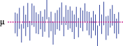

# Clase 141021

## Estadística inferencial

En la **estadística inferencial** deducimos (inferimos), a partir de la información proporcionada por una muestra, información sobre la población.

La estadística inferencia se divide en:

1. Frecuentista (la única que veremos en el curso; la más usada por los biólogos).
2. Evidencial o de verosimilitud.
3. Bayesiana (la que está ganando mayor fuerza en los últimos años; la evidencial puede verse como un subconjunto de la bayesiana).

### Estadística frecuentista

La idea subyacente a esta estadística es que una variable poblacional se puede describir con una distribución de probabilidad conocida solo parcialmente: se conoce la distribución que describe a la población, pero se desconoce el valor exacto de los parámetros de esta distribución.

Otra forma de verlo es que se hace el **SUPUESTO** de que **SE CONOCE LA DISTRIBUCIÓN DE PROBABILIDAD QUE DESCRIBE A LA VARIABLE DE INTERÉS**. Este es un GRAN supuesto y es el supuesto que tendremos en lo que resta del curso.

EJEMPLO:

X: tamaño de los individuos de una población.
Distribución de probabilidad: Normal
Parámetros: µ = desconocida, sigma = desconocida.

Pero tenemos una muestra de individuos de esta poblacion a los que le medimos la variable. A esta muestra le podemos calcular X.barra y S. Pero, ¿cómo se relaciona X.barra y S con µ y sigma, respectivamente?

#### Estimación puntual

A un valor que calculamos a partir de una muestra (e.g. X.barra y S) se le llama **estadístico** o **estimador puntual** (puntual porque es un valor único, no un intervalo).

Los estadísticos son una aproximación a los parámetros de la distribución de probabilidad que describen a una variable poblacional.

_PREGUNTA: ¿qué funciones se usan en R para calcular X.barra y S?_

#### Estimación por intervalo

En la estimación por intervalo se construye un intervalo alrededor de un estimador puntual. Este intervalo, al igual que el estimador puntual, se calcula a partir de los datos de una muestra. A este intervalo se le conoce como **intervalo de confianza** (IC, o CI en inglés).

Obviamente, para cada muestra se tendrá un IC diferente. Por lo tanto cuando decimos que se tiene una probabilidad _1-alfa_ de encontrar al parámetro en ese IC es porque reconocemos que en _alfa_% de las muestras que se puedan obtener de una población el IC construido no contendrá el valor exacto del parámetro.

Visualmente, esto se puede ver así:

Observen que hay intervalos que no contienen al parámetro.

Interpretación incorrecta de lo que es un IC: "el parámetro tiene una probabilidad de 1-_alfa_ de estar en el IC que obtuve." (pueden encontrar en la carpeta _more_ un artículo que muestra lo malentendidos que son los ICs: Hoekstra et al. 2014. Robust misinterpretation of confidence intervals.)

Esto es lo mismo que tirar una moneda cargada donde la probabilidad de EXITO es de 1-_alfa_. Al tirar la moneda ocurre EXITO **o** FRACASO. Igualmente, al construir UN intervalo de confianza particular a partir de UNA muestra, el intervalo contiene al parámetro (EXITO) o no lo contiene (FRACASO). No puede haber 1-_alfa_ probabilidad de EXITO a partir de UNA muestra. El problema es que en un evento particular (UN intervalo particular) no sabemos si lo que obtuvimos fue EXITO (el parámetro está dentro del intervalo) o FRACASO (el parámetro no está dentro del intervalo) porque el parámetro es desconocido.

Mientras menor sea _alfa_, más muestras tendrán asociado un IC que contenga al parámetro. Sin embargo, mientras menor querramos que sea _alfa_, más amplio tendrá que ser nuestro intervalo.

Por convención _alfa_ = 0.05. 

Cuanto la muestra es pequeña (no hay un valor pre-establecido de lo que es ser pequeña), debemos aceptar una mayor probabilidad de error en el IC. En estos casos _alfa_ = 0.1.

Cuando la muestra es grande o cuando queremos tener mayor seguridad de que nuestra muestra contenga al parámetro de interés, el error puede reducirse a _alfa_ = 0.01.

Diferentes áreas de la biología usan diferentes valores de alfa, dependiendo básicamente de la cantidad de datos que pueden reunirse en un estudio (_cf_. biología molecular y biogeografía).

Después de todo esto construyamos los diferentes ICs con R. En los siguientes ejemplos **supondremos** que tomamos una muestra de una población cuya variable de interés **se distribuye normal**.

##### 1. IC para µ cuando sigma es conocida

Generalmente no conocemos sigma, así que este IC casi no se usa.

Para una muestra de tamaño _n_ el IC con una confiabilidad de 1-_alfa_ es:

**x.barra ± Z_1-*alfa*/2*sigma/sqrt(n)**

En R, Z_1-alfa/2 es **qnorm(1-*alfa*/2)**

_ACTIVIDAD2: Las alturas de los individuos de una población se distribuyen normal con µ = 1.70 y sigma = 0.1 m. Obtengan una muestra aleatoria de 20 individuos de esta población con la función **rnorm()** y calculen el IC para µ asociado a esta muestra con un alfa de 0.05 suponiendo que conocen el valor de sigma. ¿Está µ dentro del intervalo?_

##### 2. IC para µ cuando sigma es desconocida

Para una muestra de tamaño _n_ el IC con una confiabilidad de 1-_alfa_ es:

**x.barra ± t_1-*alfa*/2(v = n-1)*S/sqrt(n)**

Fíjense que, como no conocemos sigma usamos S.

_PREGUNTA: ¿Como son los ICs de 1 y 2 cuando n es grande?_

_ACTIVIDAD3: Las alturas de los individuos de una población se distribuyen normal con µ = 1.70 y sigma = 0.1 m. Obtengan una muestra aleatoria de 20 individuos de esta población con la función **rnorm()** y calculen el IC para µ asociado a esta muestra con un alfa de 0.05 suponiendo que no conocen el valor de sigma._

_ACTIVIDAD4: Generen 1000 datos al azar de una distribucion normal (µ = 1.70, sigma = 0.1) usando **rnorm()**. Imaginen que toman una muestra de 10 datos de la población y resultan ser los 10 individuos más grandes de entre los 1000 datos que generamos. Usen **sort()** para identificarlos. Construyan el intervalo de confianza para la media con estos 10 datos, ¿está µ en él?_

Esta actividad también muestra la importancia de hacer muestreo probabilístico. Pero también por azar pueden salir los individuos más altos, aunque la probabilidad de ocurrencia es baja (_alfa_).
