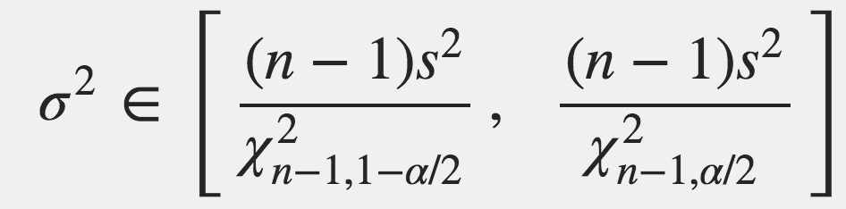
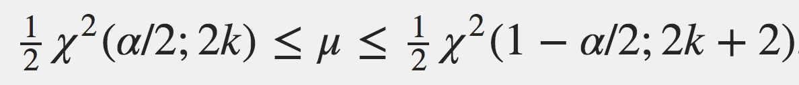

# Clase 141024

## Estadística inferencial

### Estadística frecuentista

Se hace el **SUPUESTO** de que **SE CONOCE LA DISTRIBUCIÓN DE PROBABILIDAD QUE DESCRIBE A LA VARIABLE DE INTERÉS**.

#### Estimación puntual

##### Supuesto: distribución normal

Parámetro: *µ*

Estimador: x.barra

Parámetro: *sigma*

Estimador: S

##### Supuesto: distribución binomial

Parámetro: *p*

Estimador: p.est = proporción de EXITOS en una muestra de tamaño _n_

##### Supuesto: distribución Poisson

Parámetro: *lambda*

Estimador: lambda.est = promedio de las *k_i* veces con que ocurre un evento por unidad de tiempo (área, volumen, etc.) en _n_ experimentos.

#### Estimación por intervalo

El **intervalo de confianza** se construye alrededor del estimador, es decir, es de la forma:

**estimador ± error(_alfa_,_n_)**

El intervalo de confianza depende de la muestra y por lo tanto puede haber intervalos que no contengan al parámetro.

Por convención _alfa_ = 0.05.

Como el error depende del valor de _alfa_ y del tamaño de muestra _n_ se tiene que:

1. Mientras más pequeño sea _alfa_ mayor será el error y por lo tanto mayor será la amplitud del IC.
2. Mientras más grande sea _n_ menor será el error (porque conocemos más de la población) y por lo tanto menor será la amplitud del IC.

En otras palabras:

1. El error es directamente proporcional al valor de _alfa_.
2. El error es inversamente proporcional a _n_.

##### 1. IC para _µ_ cuando sigma es conocida

**Supuesto**: La variable de interés se distribuye normal con parámetros _µ_ (desconocida) y _sigma_ (conocida).

Para una muestra de tamaño _n_ el IC con una confiabilidad de 1-_alfa_ es:

**x.barra ± Z_1-*alfa*/2*sigma/sqrt(n)**

En R, Z_1-alfa/2 es **qnorm(1-*alfa*/2)**.

##### 2. IC para µ cuando sigma es desconocida

**Supuesto**: La variable de interés se distribuye normal con parámetros _µ_ (conocida) y _sigma_ (desconocida).

Para una muestra de tamaño _n_ el IC con una confiabilidad de 1-_alfa_ es:

donde µ.gorro = x.barra = media muestral

En R, t_1-*alfa*/2,v es **qt(1-*alfa*/2,v = n-1)**.

##### 3. IC para diferencia de medias (*µ_x* – *µ_y*) cuando las _sigmas_ son conocidas

*Supuesto**: Las variables de interés (X y Y) se distribuyen normal con medias *µ_x* y *µ_y* (desconocidas), y sigmas *sigma_x* y *sigma_y* (conocidas).

Para una muestra de tamaño *n_x* de la variable X y una muestra de tamaño *n_y* de la variable Y el IC con una confiabilidad de 1-_alfa_ es:

##### 4. IC para diferencia de medias (*µ1* – *µ2*) cuando *sigma1* = *sigma2* desconocida

*Supuesto**: Las variables de interés (X1 y X2) se distribuyen normal con diferentes medias *µ1* y *µ2*, pero misma *sigma* (desconocidas).

Para una muestra de tamaño *n1* de la variable X1 y una muestra de tamaño *n2* de la variable X2 el IC con una confiabilidad de 1-_alfa_ es:

donde

##### 5. IC para diferencia de medias (*µ1* – *µ2*) cuando las *sigmas* son desconocidas

*Supuesto**: Las variables de interés (X1 y X2) se distribuyen normal con medias *µ1* y *µ2*, y sigmas *sigma1* y *sigma2* (desconocidas).

Para una muestra de tamaño *n1* de la variable X1 y una muestra de tamaño *n2* de la variable X2 el IC con una confiabilidad de 1-_alfa_ es:

donde

##### 6. IC para *sigma*^2

**Supuesto**: La variable de interés se distribuye normal con media *µ* y *sigma* (desconocidas)

Para una muestra de tamaño _n_ el IC con una confiabilidad de 1-_alfa_ es:

En R, Ji^2(1-_alfa_/2,n-1) es **qchisq(1-_alfa_/2,n-1)**.

##### 7.  IC para *p*  (*n* grande)

**Supuesto**: La variable de interés se distribuye Bernoulli con parámetro *p* (desconocida).

Se usa la propiedad de que la binomial se vuelve normal cuando *n* -> Inf. Por eso *n* tiene que ser grande para usar este IC.

Para una muestra de tamaño _n_ (grande) el IC con una confiabilidad de 1-_alfa_ es:

donde z = Z_1-alfa/2 y p.gorro = p.est = proporción de EXITOS en una muestra de tamaño _n_.

##### 8.  IC para *p*  (*n* chica)

**Supuesto**: La variable de interés se distribuye Bernoulli con parámetro *p* (desconocida).

Se introducen términos que compensan el hecho de que la _n_ es chica.

Para una muestra de tamaño _n_ (chica) el IC con una confiabilidad de 1-_alfa_ es:

##### 9.  IC para diferencia de proporciones *p_x* y *p_y*  (*n* grande)

**Supuesto**: Las variables de interés (X y Y) se distribuyen binomial con parámetros *p_x* y *p_y* (desconocidas).

Para una muestra de tamaño *n_x* de la variable X y una muestra de tamaño *n_y* de la variable X el IC con una confiabilidad de 1-_alfa_ es:

##### 10. IC para *lambda*

**Supuesto**: La variable de interés se distribuye Poisson con parámetro *lambda* (desconocida).

Para una muestra de tamaño _n_ el IC con una confiabilidad de 1-_alfa_ es:

donde *k* es la suma de las *ki*'s.

_ACTIVIDAD:_

Para cada uno de los intervalos de confianza hagan lo siguiente:

Obtengan una muestra aleatoria de tamaño 20 de la distribución de probabilidad supuesta en cada IC.
	
1. IC 1, 2 y 6: usen **rnorm()**, con *µ* = 1.70 y *sigma* = 0.01
2. IC 3 y 5: usen *µ1* = 1.66, *µ2* = 1.72, *sigma1* = 0.01, *sigma2* = 0.015, *n1* = 20, *n2* = 40
3. IC 4: usen *sigma* = 0.01
4. IC 7: usen **rbinom()**, size = 1, *p* = 0.5
5. IC 8: cambien el tamaño de muestra a 100
6. IC 9: usen *p1* = 0.4 y *p2* = 0.6, *n1* = 20, *n2* = 40
7. IC 10: usen **rpois()** con *lambda* = 2.5

Con un _alfa_ = 0.05, calculen el intervalo para el parámetro correspondiente en cada IC.

¿Cayó el parámetro dentro del IC?

¿Qué significa que el 0 esté dentro de los ICs 3, 5 y 6 cuando *µ1* y *µ2* son desconocidas?