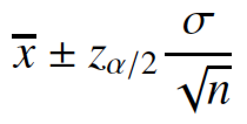
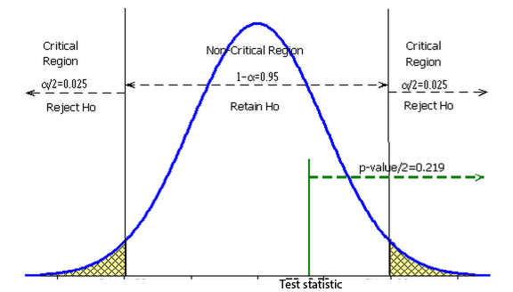

# Clase 141031

## Estadística inferencial

### Estadística frecuentista

Se hace el **SUPUESTO** de que **SE CONOCE LA DISTRIBUCIÓN DE PROBABILIDAD QUE DESCRIBE A LA VARIABLE DE INTERÉS**, PERO SE DESCONOCE EL VALOR DE AL MENOS UN PARÁMETRO QUE QUISIÉRAMOS ESTIMAR

#### Estimación puntual

Ejemplo:

**Supuesto**: distribución normal

**Parámetro desconocido**: *µ*

**Estimador**: x.barra

#### Estimación por intervalo

Ejemplo:

##### 1. IC para _µ_ cuando sigma es conocida

**Supuesto**: distribución normal con *µ* desconocida y *sigma* conocida

**Parámetro desconocido**: *µ*

**Intervalo**:

 

En los ICs el parámetro cae dentro de él en el 95% de los casos (cuando *alfa* = 0.05). Como hemos visto, no hay garantía de que el intervalo contenga al parámetro con un 100% de confiabilidad (para tener un 100% de confiabilidad tendríamos que hacer un censo). Con una muestra generamos un IC y esperamos que el IC contenga al parámetro, aunque existe una probabilidad de 5% de que el parámetro no caiga en el IC.

#### Pruebas de hipótesis

En la prueba de hipótesis nos interesa saber si el parámetro (cuyo valor desconocemos, e.g. *µ*) toma **un valor particular** (e.g. 0), i.e., queremos contestar la pregunta:

**¿El parámetro es igual al valor particular que estoy proponiendo?**

e.g.: ¿*µ* = 0?

O, vista como una hipótesis:

**El parámetro es igual al valor particular que estoy proponiendo**

Y queremos saber si esta hipótesis es verdadera o falsa.

Si la hipótesis es verdadera

1. El parámetro es igual al valor particular (e.g. µ = 0).

Si la hipótesis es falsa

2. El parámetro no es igual al valor particular (e.g. µ ≠ 0).

La primera es la **hipótesis nula** (H0) y la segunda es la **hipótesis alternativa** (Ha).

Otras hipótesis que nos podemos hacer son:

**El parámetro es mayor al valor particular que estoy proponiendo**
H0: El parámetro es mayor al valor particular (e.g. *µ* > 0)
Ha: El parámetro es menor o igual al valor particular (e.g. *µ* ≤ 0)

O

**El parámetro es menor al valor particular que estoy proponiendo**
H0: El parámetro es menor al valor particular (e.g. *µ* < 0)
Ha: El parámetro es mayor o igual al valor particular (e.g. *µ* ≥ 0)

#### Pruebas de hipótesis y Estimación por intervalo

Entendamos cómo los intervalos de confianza se relacionan con las pruebas de hipótesis y por qué los estadísticos de prueba son como son:

Retomemos el IC de la media cuando suponemos que la variable de interés se distribuye normal:

**Intervalo**:

 

Imaginemos ahora que queremos ver si *µ* = 0 (H0).

Si el cero cae en el 95 % de los IC que puedo contruir con diferentes muestras de la población, entonces muy probablemente *µ* = 0. El parámetro de hecho podría tener en realidad otro valor (digamos *µ* = 0.0001), pero como el cero cae en el 95% de mis intervalos, no podemos descartar al 0 como posible valor de *µ*. Decimos entonces que no podemos rechazar, a partir de los datos de mi muestra, la hipótesis de que *µ* = 0, i.e., que no podemos rechazar H0. Puede que nos equivoquemos y en realidad *µ* ≠ 0, pero la muestra no nos permite rechazar la posibilidad de que *µ* = 0. Y esto es importante, **NO PODEMOS AFIRMAR QUE *µ* = 0, SINO QUE NO PODEMOS RECHAZAR LA POSIBILIDAD DE QUE NO LO SEA**. 

**Las pruebas de hipótesis no permiten decir que algo es verdadero; solo permiten decir que los datos de la muestra no permiten rechazar que la hipótesis sea falsa.**

¿Cuándo podemos rechazar la H0?, i.e., ¿cuándo podemos decir que *µ* ≠ 0? Cuando más del 95% de los ICs que pueda crear no contengan al 0. Diré entonces que, con un 95% de confianza puedo rechazar la hipótesis de que *µ* = 0.

La **región de rechazo** o **región crítica** serán entonces todos los valores que no estén en el IC, o sea las colas de la distribución Z (de -Inf a Z_*alfa*/2 y de Z_1-*alfa*/2 a Inf) que, en conjunto, tienen una probabilidad de *alfa*. Y la **región de no rechazo** o **región será el IC.

Como siempre, existe una probabilidad (*alfa*) de equivocarnos y en realidad *µ* = 0 cuando nosotros decimos que *µ* ≠ 0. Este es el **error tipo I**: rechazar H0 (i.e., decir que *µ* ≠ 0) cuando en realidad es verdadera.

Lo opuesto es no rechazar H0 (i.e., decir que *µ* = 0) cuando en realidad es falsa. Este es el **error tipo II** y su probabilidad es *ß*.

#### Estadísticos de prueba y valor de p

En clases pasadas vimos **estadísticos**: cantidades que se calculan a partir de la muestra y que se relacionan con un parámetro poblacional.

Ejemplo: 

Parámetro: *µ*
Estadístico: x.barra

Otro tipo de estadísticos son los **estadísticos de prueba**: cantidades que se calculan a partir de la muestra y que sirven para probar una hipótesis estadística. Estos estadísticos tienen la propiedad de que tienen una distribución conocida.

Ejemplo: 

**Supuesto**: la población se distribuye Normal(0,sigma).

Bajo este supuesto el estadístico

Z = x.barra/sigma/sqrt(n)

se distribuye Normal(0,1).

¿Para qué prueba estadística se puede usar este estadístico?

H0: µ = 0
Ha: µ ≠ 0

Entonces, si yo quiero probar si *µ* = 0, el valor del estadístico de prueba nos da un valor de una normal estándar. Si ese valor cae dentro del intervalo de confianza de 1-*alfa* entonces no podemos rechazar la hipótesis *µ* = 0.

El **valor de p** (**p-value** en inglés) es la probabilidad de observar en una muestra un valor del estadístico mayor o igual al observado. Usando el valor de p podemos rechazar o no rechazar una hipótesis estadística:

1. Si el valor de p es menor que _alfa_, rechazamos H0.
2. Si el valor de p es mayor o igual que _alfa_, no rechazamos H0.

_ACTIVIDAD1:_

Supongamos que nos interesa saber el efecto que tienen las bajas temperaturas sobre una especie de planta. Registramos las temperaturas en un sitio a lo largo de un día. Nos interesa saber si las plantas estuvieron en promedio sometidas al grado de congelación (0ºC).

Las temperaturas a lo largo del día fueron:

-6.055 -4.826 -3.733 -2.349 -2.314 -1.601 -1.014 -0.432  0.734  2.010  4.472 5.351  5.661  4.992  2.855  1.304  0.653 -0.898 -1.142 -2.262 -2.317 -2.728 -4.236 -5.457

¿Podemos rechazar la H0: la temperatura promedio en el día fue de 0ºC?

Vayan identificando los valores de:

1. Región crítica
2. Región no crítica
3. Estadístico de prueba
4. Valor de p.

Vayan viendo gráficamente dónde se ubican estos valores, como en la figura anterior.

En R utilizamos la función **t.test()**

_ACTIVIDAD2_: Usando la función **t.test()** prueben la H0: µ = 0ºC.

_ACTIVIDAD3_: Tenemos dos muestras de las alturas de una especie de encino:

10.776197 9.219316 8.721433 9.998572 8.149022 10.451505 9.567053 10.713603 10.960695 10.381535 11.218073 9.982863 9.961791 11.243734 9.044141 10.915425 9.060662 10.112125 10.553013 10.531742

10.536710  9.939281 10.178274 10.118379  9.905810 10.921943  8.699398 10.359069 10.025867 10.777016 10.423782 10.207327  9.952062 10.272885 10.765751

Podemos decir que vienen de la misma población si las medias poblacionales coinciden. ¿Es así?

En R:

3a. Supongan que las varianzas son iguales.
3b. Supongan que no lo son.

¿Cuál es el valor del estadístico de prueba y de p?

_ACTIVIDAD4_: En un experimento vimos la proporción machos:hembras de diferentes nidadas de tortugas verdes. Si en el estudio se obtuvieron las siguientes cantidades de machos y hembras por nidada:

N1: 19 M, 18 H
N2: 30 M, 34 H
N3: 34 M, 58 H
N4: 22 M, 16 H

¿Podemos rechazar la hipótesis de que la proporción de sexos es 50:50 en cada camada? ¿En promedio?

En R, usen **prop.test()** o **binom.test()**. ¿En qué difieren?

