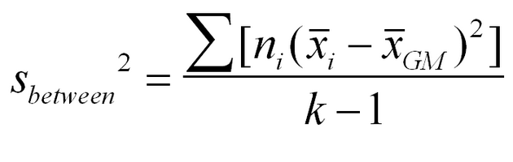
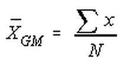

# Clase 141114

## Pruebas de hipótesis

### Análisis de Varianza

En español: ANálisis DE VArianza (ANDEVA)
En inglés: ANalysis Of VArianza (ANOVA)

**Contexto**:

* Estamos estudiando una variable X en una población.

* Hay una variación en la variable X (variación total).

* Se tiene que la población se puede dividir en *k* grupos de acuerdo a alguna variable categórica (tratamientos, sitios, condiciones ambientales, características, genotipos, etc.).

* Dentro de cada grupo la variable X varía (variación intragrupal, variación dentro de cada grupo, *within group variation*).

* Entre grupos la variable X también varía (variación intergrupal, variación entre grupos, *between group variation*).

* Queremos saber si hay más variación entre que dentro.

**Escenarios**:

1. La variación intergrupal es mayor que la variación intragrupal.

2. La variación intergrupal es mayor que la variación intragrupal.

Esto es lo mismo que

1. *sigma*b > *sigma*w

2. *sigma*b < *sigma*w

Esto es lo mismo que

1. *sigma*b/*sigma*w > 1

2. *sigma*b/*sigma*w < 1

Recordemos:

#### 6'.  H0: *sigma*12 = *sigma*22

&nbsp;&nbsp;&nbsp;&nbsp;&nbsp;&nbsp;&nbsp;&nbsp;&nbsp;Ha: *sigma*12 ≠ *sigma*22

&nbsp;&nbsp;&nbsp;&nbsp;&nbsp;&nbsp;&nbsp;&nbsp;&nbsp;Estadístico de prueba: *F* = S12/S22

&nbsp;&nbsp;&nbsp;&nbsp;&nbsp;&nbsp;&nbsp;&nbsp;&nbsp;Distribución del estadístico: *F* con n1-1 y n2-1 g.l.

Entonces 

*sigma*b/*sigma*w es una *F*

El estadístico de *sigma*b es  donde 

El estadístico de *sigma*w es 

Entonces el estadístico de prueba es 

En la **tabla de ANOVA** vamos construyendo este estadístico:

<TABLE>
   <TR>
	   <TD>Fuentes de variación </TD>
	   <TD>Suma de cuadrados </TD>
   </TR>
</TABLE>
Fuentes de variación 			Suma de cuadrados 	GL 	Cuadrados medios 	Razón de varianzas
Entre tratamientos				SCE					k-1	CME					F
Dentro de c/tratamiento (error)	SCD					N-k	CMD
Total							SCT					N-1

Entonces, dependiendo del valor de p determinaremos si rechazamos o no rechazamos la hipótesis nula.

Pero, ¿qué implica que *sigma*b/*sigma*w > 1 o < 1?

Implica:

H0: *µ*1 = *µ*2 = ... = *µ*k

Ha: al menos una *µ* es diferente de las otras

