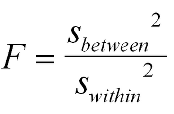

# Clase 141114

## Pruebas de hipótesis

### Análisis de Varianza

En español: ANálisis DE VArianza (ANDEVA) 
En inglés: ANalysis Of VArianza (ANOVA)

**Contexto**:

* Estamos estudiando una variable Y en una población. 
* Hay una variación en la variable Y (variación total). 
* Se tiene que la población se puede dividir en *k* grupos de acuerdo a una variable categórica X (tratamientos, sitios, condiciones ambientales, características, genotipos, etc.). 
* Dentro de cada grupo la variable Y varía (variación intragrupal, variación dentro de cada grupo, *within group variation*). 
* Entre grupos la variable Y también varía (variación intergrupal, variación entre grupos, *between group variation*). 
* Queremos saber si hay más variación entre que dentro.

**Escenarios**:

1. La variación intergrupal es mayor que la variación intragrupal. 
2. La variación intergrupal es mayor que la variación intragrupal.

Esto es lo mismo que

1. *&sigma;*b2 > *&sigma;*w2 
2. *&sigma;*b2 < *&sigma;*w2

Esto es lo mismo que

1. *&sigma;*b2/*&sigma;*w2 > 1 
2. *&sigma;*b2/*&sigma;*w2 < 1

**Recordemos:**

##### 6'.  H0: *&sigma;*12 = *&sigma;*22 
&nbsp;&nbsp;&nbsp;&nbsp;&nbsp;&nbsp;Ha: *&sigma;*12 ≠ *&sigma;*22 
&nbsp;&nbsp;&nbsp;&nbsp;&nbsp;&nbsp;Estadístico de prueba: *F* = *S*12/*S*22 
&nbsp;&nbsp;&nbsp;&nbsp;&nbsp;&nbsp;Distribución del estadístico: *F* con n1-1 y n2-1 g.l.

Entonces *&sigma;*b/*&sigma;*w se distribuye *F*

El estadístico de *&sigma;*b es 

El estadístico de *&sigma;*w es 

Entonces el estadístico de prueba es 

En la **tabla de ANOVA** vamos construyendo este estadístico:

<TABLE>
   <TR>
	   <TD>Fuentes de variación</TD>
	   <TD>Suma de cuadrados</TD>
	   <TD>GL</TD>
	   <TD>Cuadrados medios</TD>
	   <TD>Razón de varianzas</TD>
   </TR>
   <TR>
	   <TD>Entre grupos</TD>
	   <TD>SCE</TD>
	   <TD>k-1</TD>
	   <TD>CME (Sbetween)</TD>
	   <TD>F</TD>
   </TR>
   <TR>
	   <TD>Dentro de c/grupo (error)</TD>
	   <TD>SCD</TD>
	   <TD>N-k</TD>
	   <TD>CMD (Swithin)</TD>
	   <TD> </TD>
   </TR>
   <TR>
	   <TD>Total</TD>
	   <TD>SCT</TD>
	   <TD>N-1</TD>
	   <TD> </TD>
	   <TD> </TD>
   </TR>   
</TABLE>

Entonces, dependiendo del valor de *p* determinaremos si rechazamos o no rechazamos la hipótesis nula.

Pero, ¿cuál es la hipótesis nula? ¿qué implica que *&sigma;*b/*&sigma;*w > 1 ó < 1?

Observen qué pasa con las medias cuando:

1. *&sigma;*b2 > *&sigma;*w2 
2. *&sigma;*b2 < *&sigma;*w2

Entonces, en una ANOVA:

H0: *µ*1 = *µ*2 = ... = *µ*k 
Ha: al menos una *µ* es diferente de las otras

En *R* usamos **anova(lm(y~x))**.

Entonces, para usar **anova(lm(y~x))** tenemos que tener un vector *y* con los valores de la variable Y observados en la población, y un vector *x* con el grupo al que pertenece cada dato x observado.

*ACTIVIDAD1*:

Crecimiento (mm) de una especie de planta bajo 5 niveles de humedad relativa diferentes

<TABLE>
<TR><TD>1</TD><TD>2</TD><TD>3</TD><TD>4</TD><TD>5</TD></TR>  
<TR><TD>15.3</TD><TD>31.5</TD><TD>38.9</TD><TD>81.8</TD><TD>58.6</TD></TR>  
<TR><TD>16.1</TD><TD>39.6</TD><TD>36.8</TD><TD>56.9</TD><TD>54.6</TD></TR>  
<TR><TD>37.5</TD><TD>35.9</TD><TD>57</TD><TD>73.6</TD><TD>56.9</TD></TR>  
<TR><TD>28.9</TD><TD>18.9</TD><TD>56.2</TD><TD>53.3</TD><TD>64.9</TD></TR>  
<TR><TD>32.6</TD><TD>14.5</TD><TD>57.9</TD><TD>88.2</TD><TD>78.1</TD></TR>  
<TR><TD> </TD> </TD><TD>15.6</TD><TD>53.3</TD><TD>52.6</TD><TD>90.3</TD></TR>  
<TR><TD> </TD><TD> </TD><TD> </TD><TD>71</TD><TD>74.9</TD></TR>  
<TR><TD> </TD><TD> </TD><TD> </TD><TD> </TD><TD>89.8</TD></TR>  
</TABLE>

Declaren la variable y con todos estos datos. 
Declaren la variable x con un vector de la misma longitud de y, con los números de grupo al que pertenece cada dato de y.

Usen **anova(lm(y~x))**

¿Por qué usamos la función **lm()**?

### ANOVA de dos vías

**Contexto**:

* Estamos estudiando una variable Y en una población. 
* Hay una variación en la variable Y (variación total). 
* Se tiene que la población se puede dividir en grupos de acuerdo a dos variables categóricas X1 y X2 cada una con *k1* y *k2* categorías (tratamientos, sitios, condiciones ambientales, características, genotipos, etc.). 
* Dentro de cada grupo la variable X varía (variación intragrupal, variación dentro de cada grupo, *within group variation*). 
* Entre grupos la variable X también varía (variación intergrupal, variación entre grupos, *between group variation*). 
* Queremos saber si hay más variación entre que dentro.

Como tenemos dos variables categóricas tenemos varias hipótesis nulas:

H0: *µ*1,1 = *µ*2,1 = ... = *µ*k1,1  
H0: *µ*1,2 = *µ*2,2 = ... = *µ*k2,2 
H0: *µ*1,1 = *µ*2,1 = ... = *µ*k1,1 = *µ*1,2 = *µ*2,2 = ... = *µ*k2,2 

En **R**: **anova(lm(y~x1*x2))**

*ACTIVIDAD2*:

1. Lean la tabla141114.csv que está en la carpeta more y almacénenla con el nombre **datos**. 
2. Utilicen **anova(lm(y~x1*x2))**.
