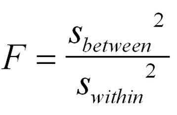
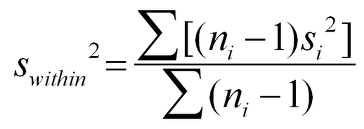

# Clase 141118

## Pruebas de hipótesis

### ANOVA (1 vía)

**Contexto**:

* Una variable *Y* continua que medimos en los individuos de una población. 
* Una variable *X* categórica con *k* categorías (e.g., tratamientos, sitios, condiciones ambientales, características, genotipos, etc.) a la que pertenecen estos individuos. 
* Queremos saber si las variables *X* está relacionada con la variable *Y*.

**Hipótesis**

H0: *µ*1 = *µ*2 = ... = *µ*k 
Ha: al menos una *µ* es diferente de las otras

**Estadístico de prueba**

donde:

 y

***R***: **anova(lm(y~x))**

Recuerden que debe **x** ser una variable categórica (pueden usar **str()** para ver si *R* la indentifica como categórica y **as.factor()** para convertir una variable en variable categórica).

### ANOVA (2 vías)

**Contexto**:

* Una variable *Y* continua que medimos en los individuos de una población. 
* Dos variables, *X*1 y *X*2 categóricas con *k*1 y *k*2 categorías a las que pertenecen estos individuos. 
* Queremos saber si las variables *X*1 y *X*2 están relacionadas (conjunta o independientemente) sobre la variable *Y*.

**Hipótesis**

Relación independiente de *X*1: H0: *µ*1,1 = *µ*2,1 = ... = *µ*k1,1  
Relación independiente de *X*2: H0: *µ*1,2 = *µ*2,2 = ... = *µ*k2,2 
Relación conjunta de *X*1 y *X*2: H0: *µ*1,1 = *µ*2,1 = ... = *µ*k1,1 = *µ*1,2 = *µ*2,2 = ... = *µ*k2,2 

**ATENCIÓN**: si no se rechaza la hipótesis de relación conjunta, no se pueden rechazar las hipótesis de relación independiente.

***R***: **anova(lm(y~x1*x2))**

Recuerden que **x1** y **x2** deben ser variables categóricas

### ANOVA (n vías)

**Contexto**:

* Una variable *Y* continua que medimos en los individuos de una población. 
* *n* variables, *X*1, ..., *X**n*, categóricas a las que pertenecen estos individuos.
* Queremos saber si las variables categóricas tienen relación (conjunta o independiente) con la variable *Y*.

**Hipótesis**

Efecto independiente de *X*1  
... 
Efecto independiente de *X*n 
Efecto conjunto de *X*1 y *X*2 
... 
Efecto conjunto de *X**n*-1 y *X*n 
Efecto conjunto de *X*1, *X*2 y *X*3 
... 
... 
... 
Efecto conjunto de *X*1, *X*2,..., y *X**n* 

**ATENCIÓN**: si no se rechaza una hipótesis de efecto conjunto, no se pueden rechazar las hipótesis de relación independiente de las variables involucradas en la hipótesis de relación conjunta.

***R***: **anova(lm(y~x1*x2*x3*...*xn))**

Recuerden que **x1** ... **xn** deben ser variables categóricas

### ANOVA anidado/jerárquico/de bloques de dos vías

* Una variable *Y* continua que medimos en los individuos de una población. 
* Dos variables, *X*1 y *X*2 categóricas con *k*1 y *k*2 categorías a las que pertenecen estos individuos. 
* La variable *X*2 está anidada (en un nivel inferior) al de la variable *X*1 (e.g. grupos dentro de materias, municipios dentro de estados, meses dentro de años, tipos celulares dentro de tipos de tejidos, especies dentro de géneros, etc.)
* Queremos saber si las variables *X*1 y *X*2 está relacionada con la variable *Y*.

**Hipótesis**

Relación a nivel de *X*1: H0: *µ*1,1 = *µ*2,1 = ... = *µ*k1,1  
Relación a nivel de *X*2: H0: *µ*1,2 = *µ*2,2 = ... = *µ*k2,2 

**R***: **anova(lm(y~x1/x2))**

*ACTIVIDAD1*:

**IGUAL QUE LOS ANOVAs, LOS ANOVAs ANIDADOS SE PUEDEN TENER MUCHOS NIVELES DE LA FORMA anova(lm(y~x1/x2/x3/.../xn))**

## Pruebas post-hoc para diferencias de medias

**Post-hoc**: después de esto. Es decir hacemos pruebas después de haber hecho un ANOVA (de 1 vía).

También se les puede llamar pruebas *a posteriori*.

¿Por qué no usar pruebas *t* para cada par de categorías de la variable *X*2?

Recordemos:

#### 5.  H0: *µ*1 = *µ*2, *sigmas* desconocidas

&nbsp;&nbsp;&nbsp;&nbsp;&nbsp;&nbsp;&nbsp;Ha: *µ*1 ≠ *µ*2

&nbsp;&nbsp;&nbsp;&nbsp;&nbsp;&nbsp;&nbsp;Estadístico de prueba: T = (x1.barra-x2.barra)/sqrt(S12/n1+S22/n2)

&nbsp;&nbsp;&nbsp;&nbsp;&nbsp;&nbsp;&nbsp;Distribución del estadístico: t-Student con v g.l.

&nbsp;&nbsp;&nbsp;&nbsp;&nbsp;&nbsp;&nbsp;R: **t.test()**

Imaginemos que tenemos una variable *X* con 3 categorías. Si quisiéramos usar pruebas *t* haríamos 

H0: *µ*1 = *µ*2 
H0: *µ*1 = *µ*3 
H0: *µ*2 = *µ*3 

En cada una tendríamos una probabilidad *alfa* de equivocarnos y rechazar la hipótesis nula cuando en realidad es cierta. En conjunto tendríamos *&alpha;*3

