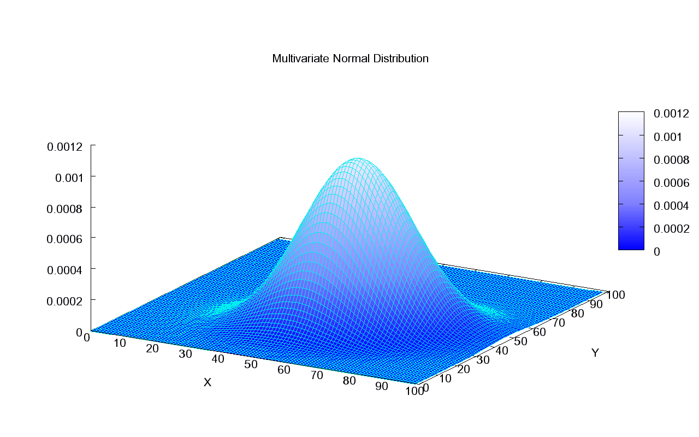

# Clase 141125

## Correlación

**Contexto**

* Tenemos dos variables continuas: *X* y *Y*.
* Queremos conocer el grado de relación que existe entre las dos variables.

### Coeficiente de correlación de Pearson

**Supuestos**

* Supone una relación lineal entre *X* y *Y*.
* Supone que *X* y *Y* se distribuyen normal bivariada.
* Una normal bivariada está definida por cinco parámetros: *µ*1, *µ*2, *&sigma;*1, *&sigma;*2 y *&rho;*.

* *&rho;* nos dice la correlación entre *X* y *Y*.

Entonces queremos estimar el valor del **parámetro** *&rho;*.

*&rho;* se relacionada con la covarianza y las varianzas de la forma:

Entonces, el **estadístico** de *&rho;* es *r*:

A esta *r* se le llama el coeficiente de correlación de Pearson.

En **R**: **cor.test(x,y)**

¿Qué sale además del valor de r?

**Hipótesis**

H0: *&rho;* = 0
Ha: *&rho;* ≠ 0

**Estadístico**: *r*

**Distribución de *r***: 

La transformación de Fisher convierte a *r* en una normal estándar:

### Coficientes de correlación de Spearman (no paramétrico)

**Supuestos**

* No suponen una relación lineal entre *X* y *Y*.

* No suponen una distribución de probabilidad para *X* y *Y*.

**Estadístico**: 

Coeficiente de correlación de Spearman: *r*S

En **R**: **cor.test(x,y,method = "spearman")**

ACTIVIDAD1:

Se realizó un estudio para ver si la longitud y el grosor de las hojas de una especie de encino se relacionaban entre sí. Bajen de la carpeta more el archivo datos.xls. Calculen las correlaciones de Pearson y Spearman para la relación entre ambas variables.

## Regresión lineal

**Contexto**

* Tenemos dos variables continuas: una independiente (*X*) y una que depende de *X* (*Y*).
* Queremos saber si una relación lineal del tipo *Y* = *ß*0 + *ß*1*X* describe apropiadamente la relación entre *X* y *Y*.
* Fíjense que se dice que *Y* depende de *X* porque estamos expresando a *Y* en términos de *X*.

**Supuestos**

1. *X* es medida sin error.
2. La relación entre *X* y *Y* es lineal.
3. *Y* se distribuye normal para cada valor de *X*.
4. Homoscedasticidad, i.e. la varianza de todas las normales asociadas a diferentes valores de *X* tienen la misma varianza.
5. Los datos de *Y* son independientes entre sí.

Existen diferentes modelos que lidian con la violación de cada supuesto:

1. Modelos de error en la medición (*errors-in-variables models*).
2. Regresión polinomial (*polynomial regresion*) y modelos aditivos (*additive models*).
3. Modelos lineales generalizados (*generalized linear models*, GLMs).
4. Modelos lineales ponderados (*weighted linear models*).
5. Modelos con factores aleatorios y con factores fijos y aleatorios (mixtos) (*random effect models* y *mixed effect models*).

Y las cosas se pueden complicar si se violan diferentes supuestos (e.g. existen los *generalized aditive mixed models, GAMMs*).

**Ajuste del modelo a los datos**

Queremos encontrar los valores de *ß*0 y *ß*1 que resulten en una línea (*Y* = *ß*0 + *ß*1*X*) que mejor se ajuste a los datos.

Existen dos métodos encontrar estos valores:

1. Mínimos cuadrados (*least squares*).

2. Máxima verosimilitud (*maximum likelihood*).

Cuando se cumple el supuesto 3 ambos métodos dan el mismo resultado. Por ello sólo veremos mínimos cuadrados.

**IDEA**: Encontrar los valores de *ß*0 y *ß*1 que resulten en una recta que minimice la distancia de los datos observados de *Y* a ella.

O sea, queremos minimizar 

.

Esta es la **suma de cuadrados del error (SCE)**. O sea, queremos  minimizar SCE.

Con este método obtenemos los estimadores de *ß*0 y *ß*1: *ß*0gorro y *ß*1gorro.

En **R**: **lm(y~x)** y para ver un resumen de los resultados **summary(lm(y~x))**.

Para ver gráficamente los datos y la recta ajustada usamos:

* Para los datos: **plot(x,y)**
* Para la recta ajustada: **abline(lm(y~x)$coefficients[1],lm(y~x)$coefficients[2])**

Para ver los residuos: **plot(x,residuals(lm(y~x)))**

ACTIVIDAD2:

Como en la ACTIVIDAD1 mostramos que existe una relación entre el grosor y la longitud de las hojas podemos buscar expresar el grosor de una hoja en función de la longitud (el grosor es más complicado de medir que la longitud). ¿Cuál sería la relación lineal entre ambas variables? Grafiquen los resultados.

**Medida de bondad de ajuste**

Para saber qué tan bueno fue el ajuste del modelo a los datos se tiene un estadístico que mide este grado de ajuste: **r2**

A r2 se le llama **coeficiente de determinación**.

Toma valores entre 0 (muy mal ajuste) y 1 (muy buen ajuste).

Pasemos ahora a hacer pruebas de hipótesis sobre este modelo.

Recordemos:

### ANOVA (1 vía)

**Contexto**:

* Una variable *Y* continua que medimos en los individuos de una población. 
* Una variable *X* categórica con *k* categorías (e.g., tratamientos, sitios, condiciones ambientales, características, genotipos, etc.) a la que pertenecen estos individuos. 
* Queremos saber si la variable *X* está relacionada con la variable *Y*.

**Supuestos**:

* La variable *Y* se distribuye normal. 
* Los datos de *Y* vienen de un muestreo aleatorio simple.

**Hipótesis**

H0: *µ*1 = *µ*2 = ... = *µ*k 
Ha: al menos una *µ* es diferente de las otras

**Estadístico de prueba**

donde:

 y

En **R**: **anova(lm(y~x))**

### ANOVA en un modelo lineal

* Tenemos dos variables continuas: una independiente (*X*) y una que depende de *X* (*Y*). 
* Queremos saber si la variable *X* está relacionada con la variable *Y* linealmente.

**Supuestos**:

* La variable *Y* se distribuye normal. 
* Los datos de *Y* vienen de un muestreo aleatorio simple. 

**Hipótesis**

H0: las *µ*'s de *Y* son iguales para cada valor de *X*. 
Ha: al menos para un valor de *X* la *µ* de *Y* es diferente de las otras.

Es decir,

H0: la variable *X* no se relaciona linealmente con *Y*. 
Ha: la variable *X* se relaciona linealmente con *Y*.

**Estadístico de prueba**

En la **tabla de ANOVA** vamos construyendo este estadístico:

<TABLE>
   <TR>
	   <TD>Fuentes de variación</TD>
	   <TD>Suma de cuadrados</TD>
	   <TD>GL</TD>
	   <TD>Cuadrados medios</TD>
	   <TD>Razón de varianzas</TD>
   </TR>
   <TR>
	   <TD>Regresión</TD>
	   <TD>SCR</TD>
	   <TD>1</TD>
	   <TD>CMR (Sregresion)</TD>
	   <TD>F</TD>
   </TR>
   <TR>
	   <TD>Error/Residuo</TD>
	   <TD>SCE</TD>
	   <TD>N-2</TD>
	   <TD>CME (Serror)</TD>
	   <TD> </TD>
   </TR>
   <TR>
	   <TD>Total</TD>
	   <TD>SCT</TD>
	   <TD>N-1</TD>
	   <TD> </TD>
	   <TD> </TD>
   </TR>   
</TABLE>

En **R**: **anova(lm(y~x))**

De esta tabla también podemos obtener *r*2:

*r*2 = SCR/SCT

## Estadística No Paramétrica

Como vimos en clase, a cada prueba paramétrica corresponde una no paramétrica que elimina el supuesto de que conocemos la distribución de la variable analizada y solo supone que la variable analizada es ordinal.

<TABLE>
   <TR>
	   <TD>Comparación</TD>
	   <TD>Prueba paramétrica</TD>
   	   <TD>En R</TD>	
	   <TD>Comparación</TD>   
	   <TD>Prueba no paramétrica</TD>
	   <TD>En R</TD>
   </TR>
   <TR>
	   <TD>2 medias</TD>
	   <TD>Prueba de t</TD>
	   <TD>t.test()</TD>
	   <TD>2 medianas</TD>
	   <TD>Prueba Mann-Whitney-Wilcoxon (U de Mann-Whitney)</TD>
	   <TD>wilcox.test()</TD>
   </TR>
   <TR>
	   <TD>2 medias de variables pareadas</TD>
	   <TD>Prueba de t</TD>
	   <TD>t.test(,paired = TRUE)</TD>
	   <TD>2 medianas de variables pareadas</TD>
	   <TD>Prueba Mann-Whitney-Wilcoxon (U de Mann-Whitney) </TD>
	   <TD>wilcox.test(,paired = TRUE)</TD>
   </TR>
   <TR>
	   <TD>k medias</TD>
	   <TD>ANOVA 1-vía</TD>
	   <TD>anova(lm())</TD>
	   <TD>k medianas</TD>
	   <TD>Prueba Kruskal-Wallis</TD>
   	   <TD>kruskal.test()</TD>
   </TR>      
</TABLE>

ACTIVIDAD3:

Retomen los datos en datos141114.csv. Hagan la ANOVA de 1 vía para comparar las medias de x entre categrías g1 y luego la Kruskal-Wallis con esa misma variable. Comparen los resultados.
¿Qué podemos concluir de cada prueba?

